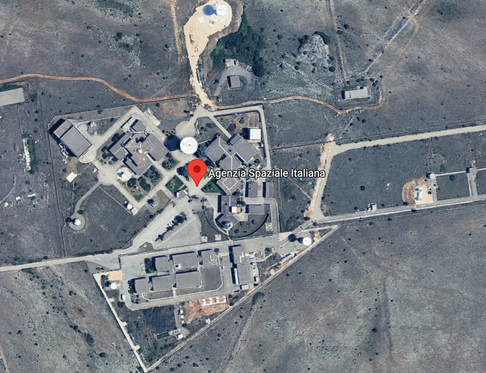
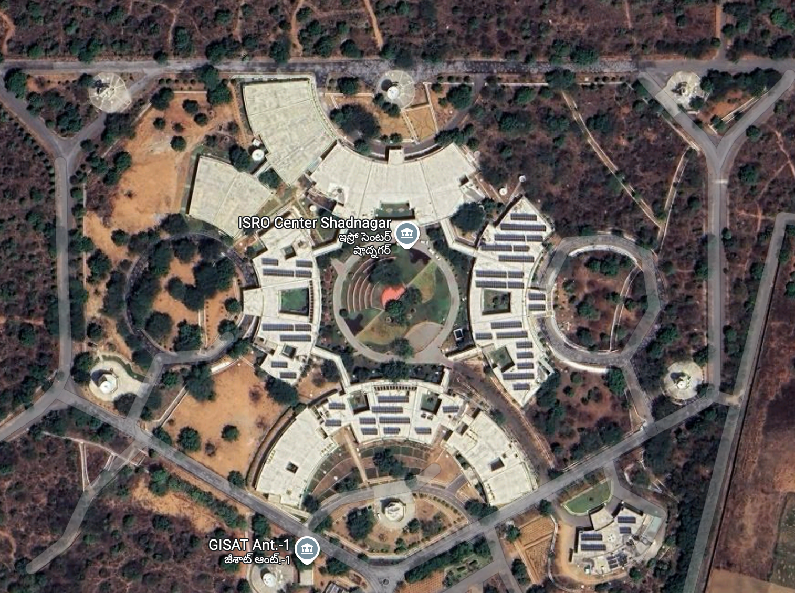

```js
import { Banner } from "/components/utils.js";
```

<div id="parent">
 ${Banner("GSO Antenna Contour")}
</div>

<div class="floatingbox sidenote" data-pinned="true">

<a class="ui right teal corner label " id="pinme" onclick="toggleWindow('.floatingbox')">
<i class="icon pin"></i></a>

<div class="">
    
```js 
const minElevation = view(Inputs.number([0, 5], {
  label: "Min. Elevation",
  value: 5
}))
```
```js
    
 const showAll = view(Inputs.toggle({label:"Show All",value:true}))
 const projectionType = view(Inputs.select(["mercator","orthographic","equirectangular","equal-Earth"], { label: "Projection Type" }));
```

```js
const selectPeriod = view(
  Inputs.range(
    d3.extent(oceansatPos, (d) => d.period),
    { step: 1, label: "period" }
  )
);
```

```js
const location = view(
  Inputs.checkbox(["Hyderabad", "Italy", "Europe", "Alaska"], {
    label: "Select Location",
    value: ["Hyderabad"],
  })
);
```

```js
const rotate = view(Inputs.range([-180, 180], { label: "Rotate", step: 1 }));
const rotateZ = view(Inputs.range([-180, 180], { label: "RotateZ", step: 1 }));
const selIndex=view(Inputs.range([0,3],{label:"Pic location for pos",step:1}));
```

</div>

</div>


```js
var x = await FileAttachment("./positions.json").json();

const position = x.map((d) => ({ ...d, location: "Generic" }));
// display({position});
```

```js
var x = await FileAttachment("./positionItaly.json").json();
const positionitaly = x.map((d) => ({ ...d, location: "Italy" }));
// display(positionitaly);
```

```js
var x = await FileAttachment("./positionEurope.json").json();
const positionEurope = x.map((d) => ({ ...d, location: "Europe" }));
```

```js
// var x = await FileAttachment(/* "positionHyd@1.json" */"https://static.observableusercontent.com/files/b7878f9e399ed72ffaba572046f087903841ae260b111f0dc85845f9dadea759b82393c6cfabbefbf59d1da02f8983813f701f9b2491f35148bd44b95786fefb").json()
let x = await FileAttachment("./positionHyd.json").json();
const positionhyd = x.map((d) => ({ ...d, location: "Hyderabad" }));
```

```js
var x1 = await FileAttachment("./positionAlaska-senitel2a.json").json();
var x2 = await FileAttachment("./positionAlaska.json").json();
// positionAlaska-senitel2a.js
const positionAlaska = [...x1.map((d) => ({ ...d, location: "Alaska" }))] // ,...x2.map((d) => ({ ...d, location: "Alaska" }))];
// display(positionAlaska)
```

```js
const positionMap = {
  General:position,
  Hyderabad: positionhyd,
  Italy: positionitaly,
  Europe: positionEurope,
  Alaska: positionAlaska,  
};
const operational = oceansatPos.filter((d) => d.elevation >= minElevation);

```

```js
const oceansatPos = CombinedPosition; //location.map(l=>positionMap[l])[0];
// display({ oceansatPos });
```

```js

const CombinedPosition = [
  // ...position,
  ...positionhyd,
  ...positionitaly,
  ...positionEurope,
  ...positionAlaska,
  
].filter((d) => d.elevation > 0);


```


```js
const orbit = turf.lineString(
  oceansatPos.filter((d) => d.period == selectPeriod).map((d) => [d.lng, d.lat])
);

const orbitFull = turf.lineString(oceansatPos.map((d) => [d.lng, d.lat]));

const ESlocs = [
  { name: "Hyderabad", pos: [78.1884, 17.0283] },
  { name: "Europe", pos: [20, 80] },
  { name: "Alaska", pos: [-155, 65] },
  { name: "Italy", pos: [16.70381973446963, 40.64925121216614] },
];

const ESlocations = turf.featureCollection( ESlocs.map((m) => turf.point(m.pos, { name: m.name }  ) ))
 
```

```js
// display(view(tleinfo))
// const SatelliteName=view(Inputs.text({label:"SatelliteName",value:"Oceansat3"}))
const SatelliteIndex=view(Inputs.select(SatelliteTLE, {format:d=> 
   {
    console.log("format ",d)
    return SatelliteTLE[d].name
    }, label:"SatelliteName",value:0}))
const SatelliteName=SatelliteTLE[SatelliteIndex].name
const tleinfo=view(Inputs.textarea({label:"TLE Info",value:SatelliteTLE[selIndex].tle}))
```

<div class="ui segment">

<div class="card">

```js 
const globe = Plot.plot({
  // width: 500,
  // style:{background:"white"
  // // currentcolor:"var(--theme-background-alt )"
  //  },
  // height: 500,
  title: "Satellite : "+SatelliteName ,
  color: {
    legend: true,
    type: "linear",
    reverse: true,
    scheme: "Magma",
    domain: [0, 90],
  },
  r: { legend: true },
  legend: true,
  projection: { type: projectionType, rotate: [-rotate, -rotateZ] },
  marks: [
    Plot.sphere({stroke:"grey"}),
    Plot.graticule(),    
    Plot.geo(world, {
      stroke: "grey",
      strokeOpacity: 0.2,
      fillOpacity: 0.5,
       fill: "lightblue"
    }),
    Plot.geo(india, { stroke: "grey", fill: "black", fillOpacity: 0.05 }),
    Plot.geo(ESlocations, {
      stroke: "white",
      r: 7,
      fill: "black",
      tip: true,
      title: "name",
      fillOpacity: 0.5,
    }),
    // Plot.geo(orbitFull, {
    //   stroke: "lightgrey",
    //   strokeWidth: 1,
    //   // strokeDasharray: [5, 5]
    // }),
    Plot.dot([esloc],{
      x: "lng",
      y: "lat",
      r:10,
      strokeWidth: 1,
}),
    // Plot.dot(oceansatPos, {
    //   filter: (d) => (showAll ? true : d.period == selectPeriod),
    //   x: "lng",
    //   y: "lat",
    //   strokeWidth: 1,
    //   r: 0.7,
    //   strokeOpacity: 0.5,
    //   fill: "green",
    //   fillOpacity: 0.5,
    // }),
 Plot.dot(pos, {
      
      x: "lng",
      y: "lat",
      strokeWidth: 1,
      // r: 1,
      // strokeOpacity: 0.5,
      tip:true,
      title:d=>`alt:${d.altitude.toFixed(0)}\nelv(d):${d.elevation.toFixed(0)},${ESlocs[selIndex].name}`,
      // stroke:"grey",
      fill:d=> {
        // return "red"
        let angle=calculateLookAngles(esloc.lat,esloc.lng,d.lat,d.lng,d.altitude)
        
        return angle.elevation>0?angle.elevation:"none";
      },
      // fillOpacity: 0.5,
    }),
    
// Plot.line(position, {
      
//       x: "lng",
//       y: "lat",
//       strokeWidth: 1,
//       // r: 1,
//       strokeOpacity: 1,
//       tip:true,
//       title:"lng",
//       stroke:"green",
//       // fill:d=> {
//       //   // return "red"
//       //   let angle=calculateLookAngles(esloc.lat,esloc.lng,d.lat,d.lng,d.altitude)
        
//       //   return angle.elevation>0?angle.elevation:"none";
//       // },
//       // fillOpacity: 0.5,
//     }),
    // Plot.dot(operational, {
    //   x: "lng",
    //   y: "lat",
    //   // marker: "square",
    //   strokeWidth: 1,
    //   strokeOpacity: 0.8,
    //   stroke: "elevation",
    //   // stroke: (d) => (d.elevation <= 5 ? "red" : "black"),
    //   fillOpacity: 1,
    //   fill: "elevation",
    // }),

    // Plot.geo(orbit, {
    //   stroke: "green",
    //   strokeWidth: 3,
    //   strokeDasharray: [5, 5],
    // }),
    Plot.geo(orbittle,{stroke:"red",strokeWidth:1,strokeOpacity:.5}),
  ],
});
display(globe);

```

<!-- Download Button -->

 ${downloadButton(globe,"image1.svg","svg")}

</div>

</div>

 

```js
display(
  Plot.rectY(
    CombinedPosition,
    Plot.binX(
      { y: "proportion" },
      { x: "elevation", fill: "location", cumulative: false,filter:d=>location.includes(d.location),thresholds:[0,5,10,20,30,40,50,60,70,80,90] }
    )
  ).plot({
    y: { grid: true,zero:true,nice:true },
    x: { ticks: [0,5,10,15,20,30,40,50,60,70,80,90],nice:true,domain:[0,90]},
    zero:true,
    nice:true,
    color: { legend: true, type: "categorical", label: "Orbit Cycle/Period" },
  })
);
```

```js
display(
  Plot.plot({
    height: 300,
    title:"Elevation over the time period",
    color: { legend: true ,scheme:"Magma" },
    // d.elevation >= 0 &&
    y: { zero: true, grid: true, domain: [0, 90] },
    x: { ticks: 15, nice: true },
    marks: [
      Plot.frame({ stroke: "lightgrey" }),
      Plot.dot(operational, {
        filter: (d) =>  location.includes(d.location),
        y: "elevation",
        x: (d) => new Date(d.readableDate),
        fill: "location",
      }),
      Plot.ruleY([5], { stroke: "red", strokeDasharray: [5, 5] }),
    ],
  })
);
```

```js
display(
  Plot.plot({
    title: "Fig. 3 Elevation vs Azimuth",
    y: { domain: [0, 90], grid: true },
    x: { domain: [0, 360], grid: true },
    color: { legend: true, domain: [0, 90], reverse: true, },
    marks: [
      Plot.dot(CombinedPosition, {
        filter: (d) => d.elevation >= 0 && location.includes(d.location),
        x: "azimuth",
        y: "elevation",
        // symbol: "location",
        tip: true,
        r:2,
        fill: "elevation",
      }),
      Plot.ruleY([5], { stroke: "black", strokeWidth: 3 ,strokeDasharray:[5,5]}),
    ],
  })
);
```

```js
function downloadButton(obj, filename = "download.json", type = "json") {
  //  const blob = new Blob([JSON.stringify(countour_geojson, null, 2)], {
  //   type: "application/geo+json"
  // });
  // const url = URL.createObjectURL(blob);
  // return url;
  // var blob = new Blob([JSON.stringify(obj)],  {type} );
  var blob;
  if (type == "svg") {
    const serializer = new XMLSerializer();
    const svgString = serializer.serializeToString(obj);
    // Create a Blob from the SVG string
    blob = new Blob([svgString], { type: "image/svg+xml" });
  } else {
    blob = new Blob([JSON.stringify(obj)], { type: "application/json" });
  }

  var url = URL.createObjectURL(blob);
  // const a = html`<a class="ui button" href="${url}" download="${filename}">⬇️ Download</a>`;
  const a = html`<a target=_blank href="${url}" download="${filename}"/a>`;
  // onclick="window.open('${url}','_blank')"
  return Inputs.button("⬇️ " + filename, {
    reduce: () => {
      a.click();
    },
  });
}
```

## Download

 The orbit path can be downloaded : ${downloadButton(position,"positions.geojson")}

 Elevation Angles at Various Locations ${downloadButton(oceansatPos,"oceansatPos.geojson")}
 
 

<!-- Satellite: Intelsat 907 (70° E) at GEO altitude (~35786 km) -->
```js
import { calculateLookAngles } from "./components/utils.js";
// const realAngles = calculateLookAngles(51.5074, -0.1278, 0, 70, 35786);

// display("--- Example for a Geostationary Satellite ---,calculateLookAngles");
// display(`Azimuth: ${realAngles.azimuth.toFixed(2)}°`);
// display(`Elevation: ${realAngles.elevation.toFixed(2)}°`);
```


```js
var world = await FileAttachment("./data/mergedworlds@3.topojson.json").json();
```

```js
// import { world, land }  from "@d3/world-map"
const india = fetch(
  "https://raw.githubusercontent.com/datameet/maps/refs/heads/master/Country/india-osm.geojson"
).then((response) => response.json());
```

<div style="display:grid ;grid-template-columns: repeat(2, 1fr)">
<figure>
  
  <figcaption>Location at Italy (40.64925121216614, 16.70381973446963)</figcaption>
</figure>
<figure>
  
  <figcaption> Location in India </figcaption>
</figure>
</div>

```js 
// import * as d3 from 'd3';
// import * as topojson from 'topojson-client';
import * as turf from "@turf/turf";
```

```js
function toggleWindow(selector) {
  const p = document.querySelector(selector);
  const isPinned = p.getAttribute("data-pinned") === "true";
  p.setAttribute("data-pinned", !isPinned ? "true" : "false");

  //  if(isPinned){
  //   }
  p.classList.toggle("ui");
  p.classList.toggle("segment");
  //  p.classList.toggle("floatingbox");
  p.classList.toggle("sidenote");

  // console.log(window);
}
```

```js 

const esloc=({lat:ESlocs[selIndex].pos[1],lng:ESlocs[selIndex].pos[0]})
// const angles=calculateLookAngles(esloc[0],esloc[1], 0, 70, 35786)

const results=CombinedPosition.map(d=>{
const res=calculateLookAngles(esloc.lat,esloc.lng,d.lat,d.lng,d.altitude)
// d.elevation=res.elevation<0?null:res.elevation
return res.elevation<0?null:res.elevation
}).filter(d=>d>=0)


const R3countries=turf.featureCollection(world.filter(d=>d.properties.ITURegion=="R3"))

// display({R3countries})
display({CombinedPosition});
display({orbit,orbitFull,ESlocs,results})
```

```js
const oc3=`1 21397U 91039A   25231.21714033  .00002229  00000-0  16311-3 0  9998 
2 21397  82.5192 172.7543 0012906 304.5618  55.4389 15.03085306855682`

// const tleinfo=view(Inputs.textarea({label:"TLE Info",value:oc3}))
```

```js echo

const pos= getOceansat2Positions(tleinfo, 24, new Date(), esloc.lat , esloc.lng);
const orbittle = turf.lineString(
  pos.map((d) => [d.lng, d.lat])
);
display(orbittle)
```


```js  
// This function will return an array of latitude and longitude objects over a given period
function getOceansat2Positions(tle, hours, initialNow, esLat, esLng) {
    const meanMotion = getMeanMotion(tle);
    const period = (1 / meanMotion) * 24 * 60;
    const hoursInMs = hours * 60 * 60 * 1000;
    const stepInMs = 60 * 100; // Get position every minute
    const positions = [];

    for (let i = 0; i < hoursInMs; i += stepInMs) {
        const timestamp = initialNow.getTime() + i;
        const latLonObj =  getLatLngObj(tle, timestamp);
        const periodNumber = Math.floor(i / (period * 60 * 1000)) + 1;
        const offsetInMinutes = (timestamp - initialNow.getTime()) / (1000 * 60); // Calculate offset

        const satInfo = getSatelliteInfo(
            tle,
            timestamp,
            esLat,
            esLng,
            0 // Observer elevation (km)
        );

        const positionData = {
            ...latLonObj,
            timestamp,
            readableDate: new Date(timestamp).toUTCString(),
            period: periodNumber,
            offset: offsetInMinutes,
            altitude: satInfo.height
        };

        if (esLat && esLng) {
            positionData.azimuth = satInfo.azimuth;
            positionData.elevation = satInfo.elevation;
        }

        positions.push(positionData);
    }

    return positions;
}


```

```js
import { getLatLngObj, getMeanMotion, getSatelliteInfo } from 'tle.js';
const oc3tle=await  FileAttachment("./data/oceansat3.tle").text()
const sen2a=await  FileAttachment("./data/senitel2a.tle").text()
const SatelliteTLE=[{name:"Oceansat3",tle:oc3tle},{name:"Senitel2A",tle:sen2a}]
display({SatelliteTLE})
```